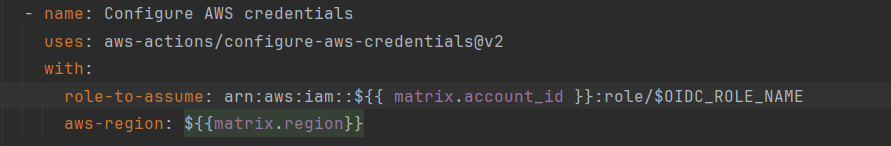
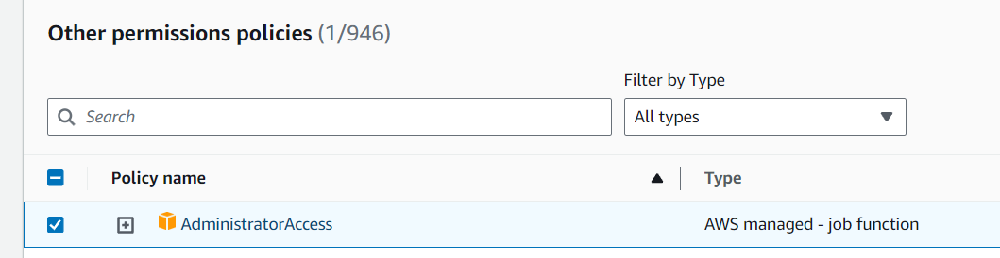

# AWS EC2 Multi Account Management

## Description

This repo serves as a PoC for managing EC2 instances in an AWS Organizations accross multiple accounts.  

## Global Prerequisites

The following resources are required to set up the **controller** environment  
1) GitHub Repo, GitHub Workflow and GitHub Secrets for running the Ansible Playbooks
2) AWS S3 Bucket for Ansible SSM Connection Plugin*
3) Example Ansible playbook to test PoC

> *The Ansible SSM Connection plugin uploads each Ansible Task as Python to a S3 Bucket. Then Ansible SSM Connection plugin then generates a presigned URL for S3 from the controller, and then will pass that URL to the target over SSM, telling the target to download/upload from S3 with curl.  
>   
> 1) Due to this design the Target EC2 Instance Profile does not need permissions on the S3 Bucket
> 2) For our PoC all accounts will use **one global** s3 bucket for transferring data/tasksm however the user is recommended to set up one bucket per region, at minimum, in production. For extra security the user could also consider deploying one s3 bucket per target AWS Account + Region in production. As the Ansible Tasks may transfer sensitive data to EC2 hosts and there is a _potential_ risk that this data may be left permanently in the transfer S3 Bucket (timeouts/networking or error conditions).
> 3) It is also recommended users add a s3 lifecycle policy, to delete any left over transfer data due to error conditions, to the S3 bucket(s) used for the above reason. We will consider this out of scope for this PoC 

## Target AWS Account Prerequisites

Each target AWS Accounts needs the following resources:  
1) AWS Role with a **fixed** naming convention. For this PoC we will use the name: `oidc-org-ec2-management-role`  
2) Trusted Policy Configured on the Role to allow the GitHub repo to assume the role with **oidc**  
3) Permissions on the role to connect to ec2 instances via SSM and describe instances in the AWS Account  
4) Permissions for the role to write data to Global S3 Bucket
5) AWS SSM Service Running on each target ec2 instance 

## Deployment Preparation  

From this point in the document we will use the following variable names for reference - the user should decide on their own names/naming conventions for their org and update the usages appropriately:

| Variable           | Example Value                                 | Resource    | Details                                              |
|--------------------|-----------------------------------------------|-------------|------------------------------------------------------|
| `$S3_BUCKET`       | `ssm_s3_transfer_bucket`                      | S3 Bucket   | The global S3 transfer bucket name                   |
| `$OIDC_ROLE_NAME`  | `oidc-org-ec2-management-role`                | IAM Role    | The IAM Role name we will assume in each AWS Account |
| `$AWS_ACCOUNT_IDS` | `[ AAAAAAAA, BBBBBBBB ]`                      | AWS Account | The list of Target AWS Accounts for this PoC         |
| `$GITHUB_REPO`     | `aws-ec2-multi-acc-mgmaws-ec2-multi-acc-mgmt` | GitHub Repo | The GitHub Repo for the Controller Environment       |

## Global Setup Instructions

### 1) GitHub Repo, GitHub Workflow and GitHub Secrets for running the Ansible Playbooks

The user should create a **private** GitHub repo for the PoC in their GitHub Org/Acc  
The user should copy all files in this repo to theirs (can omit this readme if required)  

The user must set values for the account(s) and region(s) targeted in [ansible_run.yml](.github/workflows/ansible_run.yml) and [ansible_list_instances.yml](.github/workflows/ansible_list_instances.yml)  

The user must replace the value for `$OIDC_ROLE_NAME` in these files  

**:exclamation: This must be the same name in all target accounts!**

### 2) AWS S3 Bucket for Ansible SSM Connection Plugin

The user must create a single S3 Bucket that all AWS Accounts OIDC Roles have permissions on.  
The user can use [s3-bucket-policy.json](resources/s3-bucket-policy.json) as a guide and replace `$FIRST_AWS_ACCOUNT_ID`, `$SECOND_AWS_ACCOUNT_ID`, `$OIDC_ROLE_NAME` and `$S3_BUCKET` name with their values.  

> As we are using one S3 Transfer Bucket for the PoC all targeted AWS accounts must be added to the bucket-policy above

### 3) Example Ansible playbook to test PoC

We have created an example playbook at [playbook.yml](ansible/playbook.yml) that the user should use.  
This example shows how to run a local setup task, how to use variables passed from the command line, how to switch users and how to access and print host metadata.  
Tutorials on parallel executions and best practices are out of scope.  

## Target AWS Account Setup Instructions

:exclamation: The following steps need to be performed in **every** target AWS Account :exclamation:

### 1: AWS Role with a **fixed** naming convention.

For this PoC we will use the name: `oidc-org-ec2-management-role`  
This IAM Role should be created in each target AWS Account  

### 2: Trusted Policy Configured on the Role to allow the GitHub repo to assume the role with **oidc**  

The user must configure a trust policy to allow the $GITHUB_REPO to Assume the identity of the IAM Role `oidc-org-ec2-management-role` in each AWS Account  
The user can use [oidc-trust-policy.json](resources/oidc-trust-policy.json) as a guide  

> OIDC tutorial out of scope for this PoC  
> Reference here: https://docs.github.com/en/actions/deployment/security-hardening-your-deployments/configuring-openid-connect-in-amazon-web-services#adding-the-identity-provider-to-aws  

### 3: Permissions on the role to connect to ec2 instances via SSM and describe EC2 instances in the AWS Account

The `oidc-org-ec2-management-role` must have permissions to connect to instances via ssm and discover ec2 instances.  
A detailed breakdown of the IAM Role Permission requirements is not delivered in the PoC.  
Users are recommend to assign the AdministratorAccess default policy for the PoC and work on granular permissions requirements later  

### 4: Permissions for the role to write data to Global S3 Bucket

The IAM Oidc role in each AWS Account also requires the following permissions on the Global S3 Transfer Bucket  

`s3:GetObject`, `s3:PutObject`, `s3:ListBucket`, `s3:DeleteObject` and `s3:GetBucketLocation`.  

A example granular policy is not provided for the PoC as this is also covered by the AdministratorAccess default policy  

### 5: AWS SSM Service Running on each target ec2 instance 

The AWS SSM Service must be running on each ec2 target host - installing/configuring the SSM Agent is not covered in this PoC  

## Testing 

Once all steps have been completed the user can run the GitHub Workflows in their repository.

1) Ansible Run Playbook: Iterates through Accounts and Regions in a matrix and runs the Playbook on all Hosts (parallel/concurrency advice out of scope) using the OIDC Role  
2) Ansible List all Discovered Hosts: Outputs a List of all Hosts discovered by the ec2 dynamic inventory plugin for each AWS Account and Region

